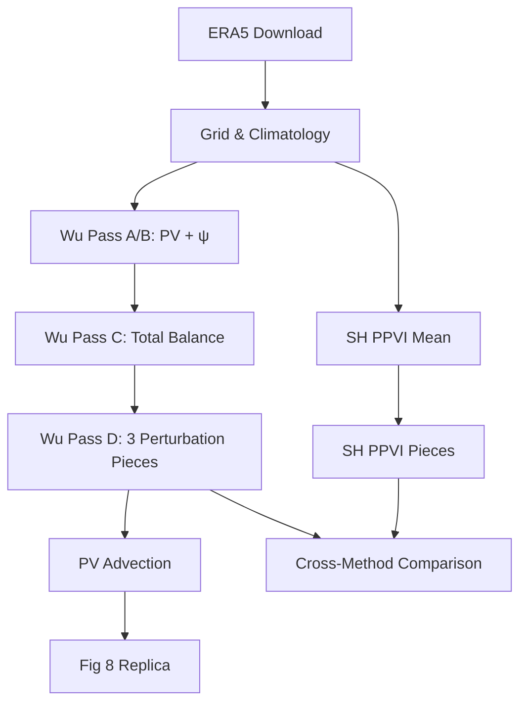

Piecewise Potential Vorticity Inversion (PPVI) for diagnosing atmospheric
blocking events — replicating Davis et al. (2022, *J. Climate*, Fig. 8).

**Source repository:** [github.com/yanxingjianken/PV_Inversion](https://github.com/yanxingjianken/PV_Inversion)

---

## Overview

PPVI decomposes the full PV field into a **mean** (climatological) component
and **anomaly** pieces, then inverts each piece to recover the associated
balanced wind and geopotential height perturbations. This isolates the
dynamical contribution of specific PV features (e.g., upper-level PV
anomalies) to blocking anticyclones.

The project implements **two parallel inversion backends**:

| Backend | Method | Grid | Status |
|---------|--------|------|--------|
| **Wu (Fortran SOR)** | Successive Over-Relaxation + nonlinear balance | Finite σ-box (87×51, NH) | ✅ Working |
| **SH (Spectral)** | Spherical-harmonic diagonalisation | Global NH sphere | ⚠️ Ongoing |

## Pipeline



## Wu (Fortran) Track — ✅ Working

The reference pipeline uses the original Davis/Emanuel F77 SOR solver:

| Pass | Program | Role |
|------|---------|------|
| **A/B** | `pvpialln_94UV` | Ertel PV + balanced ψ for climatology & event |
| **C** | `qinvert21` | Refine total balanced ψ (nonlinear balance) |
| **D** | `qinvertp21` | 3 piecewise perturbation ψ inversions |

- **Domain:** 85.5°N–10.5°S, 169.5°W–40.5°W (NH window, 1.5° resolution)
- **Vertical:** 10 σ levels (1.0 → 0.2)
- **Climatology:** 30-day symmetric running mean
- **Produces:** Davis (2022) Fig. 8 replica + 11 diagnostic plots

## SH (Spectral) Track — ⚠️ Ongoing

The experimental spectral-harmonic solver diagonalises the PV inversion
operator per spherical-harmonic wavenumber with a 10×10 LU per mode.

**Current status (June 2026):**
- Wu mean-state and event-state PV computation aligned
- Non-dimensional scaling fixed (erroneous $f_0$ factor removed from $S_{nd}$)
- SH solver converges but produces induced winds ~10× weaker than Wu
- Root cause: β-plane approximation in the SH thermal-wind link
- Upgrade path documented in `sh/sh_ppvi/invert_piece.py`

## Quick Start

```bash
# Edit event date, region, resolution
vim config.py

# Shared data prep (ERA5 download + climatology)
for s in shared_steps/0[1-4]_*/; do
    micromamba run -n blocking python "$s"/*.py
done

# Wu Fortran track → fig8_replica.png
for s in wu/steps/0[5-9]_*/ wu/steps/10_*/; do
    micromamba run -n blocking python "$s"/*.py
done
```

## Key Reference

Davis, C. A., M. T. Stoelinga, and M. L. Weisman, 2022: Piecewise Potential
Vorticity Inversion: Application to winter storms and a new treatment of the
lower boundary. *J. Climate*, **35**, 5041–5057.

## Resources

- Code & documentation: [github.com/yanxingjianken/PV_Inversion](https://github.com/yanxingjianken/PV_Inversion)
- Handbook (LaTeX/PDF): `handbook/ertel_pv_handbook.pdf`
- Environment: `micromamba run -n blocking` (or `fourcastnetv2`)
